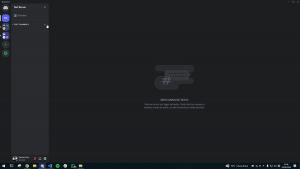

# Discord-Integration

## Steps

1. Create a text channel in your discord server.
2. Right click on the channel and go to `Edit Channel`.
3. Go to `Integrations` and click on `Create Webhook`.
4. Click on `Copy Webhook URL` and save it somewhere.

5. Go to the repository where you want to integrate discord.
6. Go to `Settings` -> `Webhooks` -> `Add Webhook`.
7. Paste the copied webhook URL in the `Payload URL` field and add `/github` at the end of the URL.
8. Set the `Content type` to `application/json`.
9. In the `Which events would you like to trigger this webhook?` section, select the events you want to trigger the webhook.
10. Click on `Add Webhook`.
11. If everything is set up correctly, you will see a green ✔️ tick mark next to the webhook URL.

### Now, whenever the selected events occur in the repository, a message will be sent to the discord channel.

